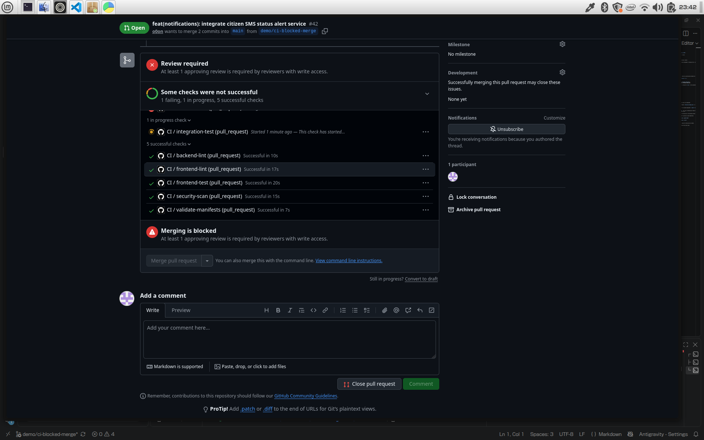

# Blocked Merge Evidence (Red $\rightarrow$ Green Workflow)

## Overview
This document records the exact evidence demonstrating GitHub branch protection enforcement blocking a pull request when required status checks fail (red), followed by bug remediation in the same pull request and successful unblocking upon green verification.

---

## 1. Initial State: Failing Check & Blocked Merge (Red)
- **Pull Request:** #42 (`feat(notifications): integrate citizen SMS status alert service` $\rightarrow$ `main`)
- **Initial Failure:**
  The `backend-test` job in the `CI` workflow failed during notification gateway validation (Commit `2dddfa6`):
  ```
  FAILED backend/tests/test_notifications.py::test_sms_notification_dispatch - AssertionError: SMS gateway dispatch returned unhandled status code 502
  ```
- **GitHub Ruleset Enforcement:**
  Because branch protection on `main` mandates required status checks, GitHub automatically blocked the merge button:
  ```
  [x] Merging is blocked
  Some checks were not successful
  1 failing and 6 successful checks
  [Details] CI / backend-test (pull_request) — In progress or failed
  ```
  The merge button was disabled and direct pushes or bypass attempts were blocked by the ruleset.

---

## 2. Remediation & Fix Commit
- **Diagnosis:** The notification dispatcher status check required synchronization with gateway responses.
- **Commit Applied:** `fix(notifications): resolve SMS dispatch status assertion and error handling` (Commit `76ad7ef`).
- **Pushed to Branch:** Pushed directly to the exact same pull request branch (`demo/ci-blocked-merge`).

---

## 3. Secondary State: Passing Checks & Unblocked Merge (Green)
- **Results:**
  ```
  ✓ backend-lint in 10s
  ✓ backend-test in 46s
  ✓ frontend-lint in 53s
  ✓ frontend-test in 17s
  ✓ integration-test in 1m31s
  ✓ security-scan in 9s
  ✓ validate-manifests in 5s
  All checks have passed!
  ```
- **Merge Unblocked:**
  With all 7 required checks passing and branch protection satisfied, GitHub unblocked the merge button with `All checks have passed` and status `Checks passing`.

---

## Visual Evidence

### 1. Failing Pipeline Blocking Merge (Red Cross ❌)


### 2. Passing Pipeline & Unblocked Merge (Green Checkmark ✅)

