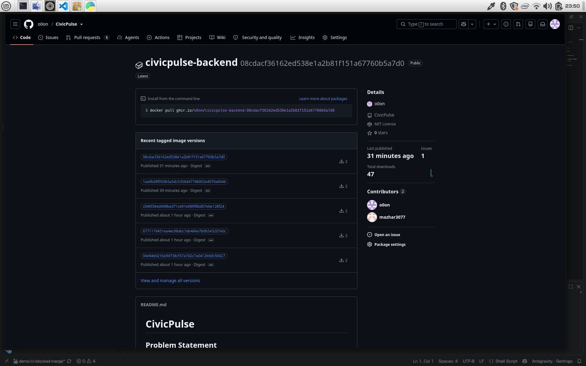

# GitHub Container Registry (GHCR) Image Evidence

## Overview
This document records the automated container image build and publishing pipeline configured via GitHub Actions CD (`.github/workflows/cd.yml`). All container images deployed to production and staging are uniquely versioned by their immutable Git commit SHA rather than mutable `:latest` tags.

---

## Published Packages

### 1. Backend Container Image
- **Package Name:** `civicpulse-backend`
- **Registry URI:** `ghcr.io/o0on/civicpulse-backend`
- **Image URL:** [https://github.com/o0on/CivicPulse/pkgs/container/civicpulse-backend](https://github.com/o0on/CivicPulse/pkgs/container/civicpulse-backend)

---

### 2. Frontend Container Image
- **Package Name:** `civicpulse-frontend`
- **Registry URI:** `ghcr.io/o0on/civicpulse-frontend`
- **Image URL:** [https://github.com/o0on/CivicPulse/pkgs/container/civicpulse-frontend](https://github.com/o0on/CivicPulse/pkgs/container/civicpulse-frontend)

---

## Architectural Rationale
As documented in [ADR 0003: Deploy by Git Commit SHA](../adr/0003-deploy-by-sha.md), pinning container images to explicit Git commit SHAs guarantees:
1. **Deterministic Rollbacks:** The exact state of backend and frontend code is captured per image.
2. **Cache Integrity:** Prevents Kubernetes `ImagePullPolicy: IfNotPresent` from silently running stale `:latest` cached layers.
3. **Traceability:** Any running container in the cluster can be mapped directly to its source Git commit in GitHub history.
